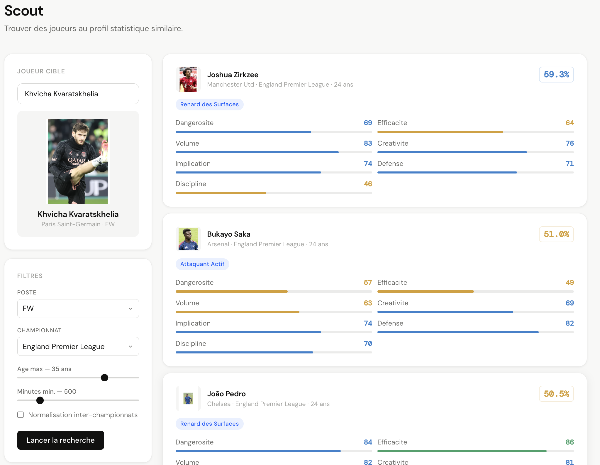
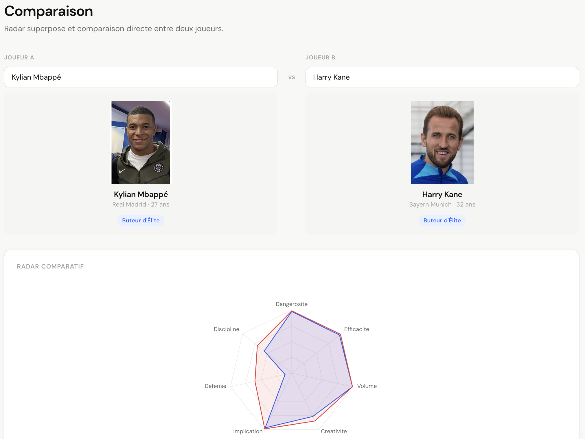
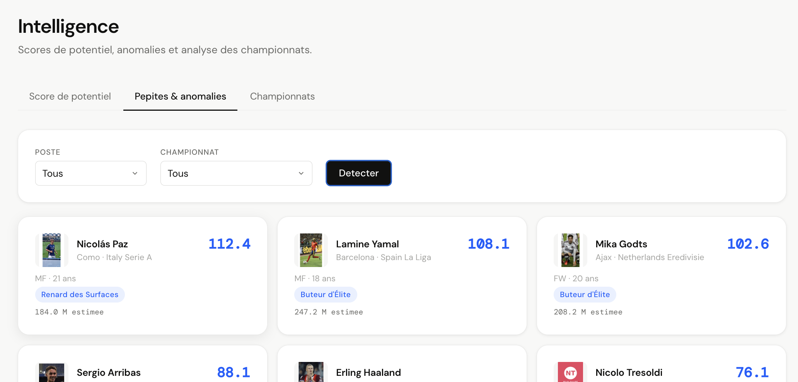

# Statfield

Statfield est une plateforme d'analyse de données football que j'ai construite de zéro concernant la saison 2025-2026. L'idée de départ était simple : aller au-delà des statistiques de surface et comprendre le profil réel d'un joueur à travers ses données de jeu.

Le projet couvre 14 championnats européens et environ 9 000 joueurs. Plusieurs étapes ont été réalisées sur ce projet : collecte des données, traitement, machine learning, API et interface web.

## Contexte et motivation

Les outils d'analyse football accessibles au grand public se limitent souvent à des tableaux de stats brutes. Ce qui m'intéressait, c'était de construire quelque chose de plus analytique : comprendre pourquoi un joueur est bon à son poste, identifier des profils similaires dans d'autres championnats, détecter des joueurs sous-cotés.

Le second objectif était technique. Je voulais travailler sur des données réelles et construire une application complète, de la collecte jusqu'à la visualisation, sans passer par un dataset pré-formaté.

## Collecte des données

Les données viennent de FBref, qui propose des statistiques avancées gratuites sur les joueurs professionnels. J'ai écrit un scraper Python qui récupère six catégories de statistiques pour chaque championnat : statistiques standard, tirs, passes, actions défensives, possession et données diverses.

Le scraper couvre les cinq grands championnats européens, leurs deuxièmes divisions respectives, ainsi que le Portugal, les Pays-Bas, la Belgique et la Turquie.

La difficulté principale était la structure des tableaux FBref : les en-têtes sont sur deux niveaux, certaines colonnes se répètent entre catégories, et les joueurs transférés en cours de saison ont plusieurs lignes. J'ai utilisé le Player ID FBref comme clé de jointure.

Pour les joueurs transférés, j'ai implémenté une logique de fusion qui additionne les statistiques brutes des deux clubs, puis recalcule les ratios par 90 minutes sur le total. Additionner directement les ratios serait mathématiquement incorrect, car un joueur ayant joué 200 minutes dans un club et 1200 dans un autre ne devrait pas se voir attribuer la somme de ses ratios.

## Traitement et machine learning

Une fois les données collectées, l'app utilise un fichier ml.

La première étape consiste à normaliser toutes les statistiques en ratios par 90 minutes, pour rendre les joueurs comparables indépendamment du temps de jeu.

Ensuite, je calcule sept dimensions tactiques pour chaque joueur : la dangérosité, l'efficacité, le volume offensif, la créativité, l'implication, la défense et la discipline. Chaque dimension est construite à partir de plusieurs statistiques standardisées via un StandardScaler. Sans cette normalisation, une variable avec une grande variance écraserait les autres dans le calcul.

À partir de ces sept dimensions, je calcule des percentiles par poste. Un attaquant est comparé aux autres attaquants, un défenseur aux autres défenseurs. L'objectif est de situer chaque joueur dans son contexte.

Pour les profils tactiques, j'utilise un algorithme K-Means avec 12 clusters sur les joueurs de champ. J'ai choisi K-Means pour son interprétabilité : le centroïde de chaque cluster représente le profil moyen des joueurs qui le composent, ce qui permet d'en déduire un label lisible. Le nombre de 12 profils résulte d'un compromis entre avoir des groupes distincts et éviter les micro-clusters difficiles à nommer.

Le score de potentiel combine le score global, un coefficient d'âge décroissant et un facteur basé sur les minutes jouées. Il peut dépasser 100 pour les très jeunes joueurs très performants, ce qui permet de distinguer des profils prometteurs de joueurs confirmés au même niveau de performance actuelle.

Pour la détection de pépites, j'utilise un Isolation Forest. Cet algorithme identifie les joueurs statistiquement atypiques sans hypothèse sur la distribution des données. Un joueur anormal dans le bon sens, c'est-à-dire avec un profil statistique inhabituellement bon pour son niveau et son championnat, est considéré comme une pépite potentielle.

## Architecture technique

Le backend est une API FastAPI qui expose les données via des endpoints REST. Les données sont chargées en mémoire au démarrage et mises en cache, ce qui évite de relire le fichier parquet à chaque requête. L'API gère deux états : les données brutes et les données fusionnées pour les joueurs transférés. Elle supporte également un mode de calcul des percentiles en scope local, où chaque joueur est comparé uniquement aux joueurs de son propre championnat.

Le frontend est une application React construite avec Vite.

L'ensemble tourne sur un serveur Scaleway.

## Fonctionnalités

La page de profil joueur affiche les statistiques par 90 minutes adaptées au poste, sept barres de percentile colorées, un radar interactif dont les axes sont configurables, les scores d'évaluation et un bouton d'export PDF. La fiche PDF est générée côté serveur avec ReportLab et reprend l'ensemble des informations du profil.

Le moteur de scout permet de trouver les joueurs au profil statistique le plus similaire à une cible. La similarité est calculée par distance euclidienne dans l'espace des features standardisées, avec une conversion en score de similarité via une décroissance exponentielle. Une option de normalisation inter-championnats est disponible pour tenir compte des différences de niveau entre ligues.

  

La page de comparaison permet de mettre deux joueurs côte à côte avec un radar superposé et des percentiles en colonnes.

  

La vue terrain affiche l'effectif complet d'un club positionné sur un terrain, avec une couleur par joueur qui reflète son score par poste.

La section intelligence regroupe le classement des joueurs par score de potentiel, la détection des anomalies statistiques et une vue comparative des championnats.

  

Le projet est accessible à l'adresse suivante : **https://statfield.grassian.eu**

Ce dépôt ne contient pas le code source complet de l'app pour des raisons de protection/sécurité. 

